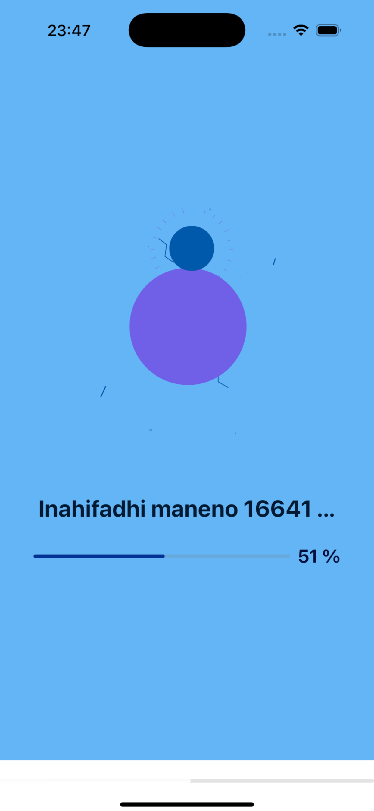
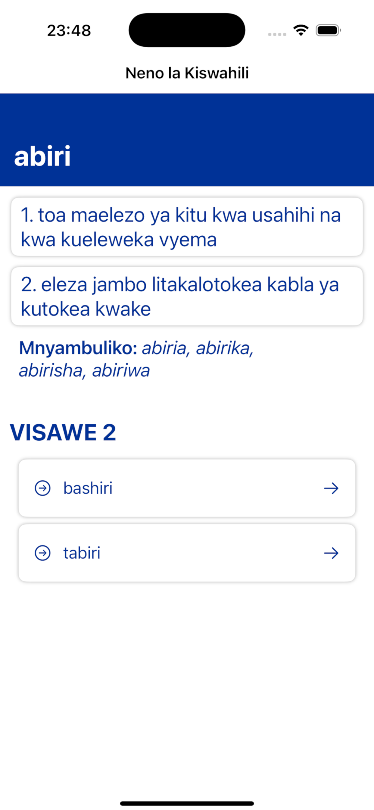

# SwahiLib - Kamusi ya Kiswahili
SwahiLib is an iOS app that allows users to search and explore **Swahili words, idioms, sayings, and proverbs** — with offline support and synonyms included where available.

Built with **SwiftUI**, **Core Data**, and backed by **Supabase**, the app offers an intuitive and fast experience even without an internet connection.

> 🔗 Android Version Repo: [@SiroDaves/SongLib-Android](https://github.com/SiroDaves/SongLib-Android)

<a href="https://apps.apple.com/us/app/id6446771678">
  
</a>

## ✨ Screenshots
<table>
    <tr>
        <td></td>
        <td></td>
        <td></td>
    </tr>
</table>

## ✨ Features

* 🔍 **Search** for Swahili **words**, **idioms**, **sayings**, and **proverbs**
* 📌 **Tap an item** to view full details

  * For words and proverbs, view related **synonyms**
* 📥 **Offline-first** experience powered by **Core Data**
* 💫 **Smooth animations** with **Lottie**
* ⚙️ **Dependency injection** using **Swinject**


## 🧰 Tech Stack

* [Supabase](https://supabase.com/) — Backend, Auth, and Database
* [Lottie](https://github.com/airbnb/lottie-ios) — Animation rendering
* [Swinject](https://github.com/Swinject/Swinject) — Dependency Injection
* Core Data — Local persistence for offline use
* SwiftUI — Declarative UI framework

## 🚀 Getting Started

### 1. Clone the Repository

```bash
git clone https://github.com/SiroDaves/SongLib-iOS.git
cd SongLib-iOS
```

### 2. Set up Supabase Environment

Create your environment file by copying the example:

```bash
cp .env.example .env
```

Then, fill in the `.env` file with your Supabase credentials (API URL, anon/public key, etc.)

---

### 3. Open in Xcode

```bash
open SwahiLib.xcodeproj
```

Or open `SwahiLib.xcworkspace` if you're using CocoaPods or other workspace-based dependency managers.

### 4. Install Dependencies

Ensure you have [CocoaPods](https://cocoapods.org/) or use Swift Package Manager. If using CocoaPods:

```bash
pod install
```

Or if using Swift Package Manager, just build the project in Xcode and it will fetch the packages.

### 5. Build and Run

Select the correct simulator or your iOS device in Xcode, then hit:

```
Cmd + R
```

## 💡 Notes

* The app uses Core Data to cache and persist content for offline usage.
* Supabase is used for syncing and querying the latest content.
* For development and testing, you can mock network calls or pre-load your Core Data store.

## 📄 License

This project is licensed under the MIT License.
